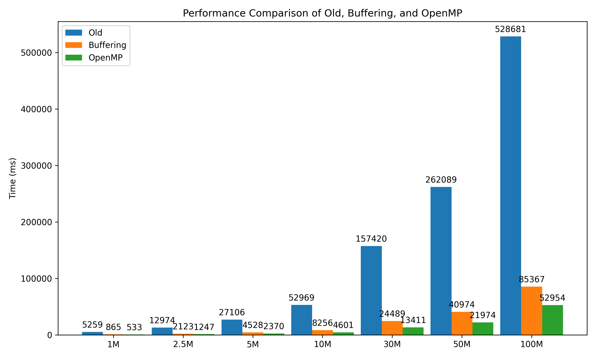

# FASTX-Toolkit
The project is based on [agordon/fastx_toolkit](https://github.com/agordon/fastx_toolkit)

The goal is to improve processing performance.
It provides improved performance through 3 methods:

1. Buffering
2. OpenMP
3. CUDA 

OpenMP and CUDA versions use buffering by default.

# Features
- [x] FASTX Statistics
	- [x] [Buffering](fastx-toolkit/fastx-qual-stats)
	- [x] [OpenMP](fastx-toolkit/fastx-qual-stats-omp)
	- [ ] [CUDA](fastx-toolkit/fastx-qual-stats-cuda)
- [x] [FASTX Sample Generator](fastx-samp-gen)

# Benchmarks
Device: GA403UI-QS091

| Record Size | Old (ms) | Buffering (ms) | OpenMP (ms) | Buffering Speedup (%) | OpenMP Speedup (%) | OpenMP vs Buffering Increase (%) |
|-------------|----------|----------------|--------------|------------------------|---------------------|----------------------------------|
| 1M          | 5259     | 865            | 533          | 83.6                   | 89.9                | 38.4                             |
| 2.5M        | 12974    | 2123           | 1247         | 83.7                   | 90.4                | 41.0                             |
| 5M          | 27106    | 4528           | 2370         | 83.3                   | 91.2                | 47.7                             |
| 10M         | 52969    | 8256           | 4601         | 84.4                   | 91.3                | 44.2                             |
| 30M         | 157420   | 24489          | 13411        | 84.4                   | 91.5                | 45.3                             |
| 50M         | 262089   | 40974          | 21974        | 84.4                   | 91.6                | 46.4                             |
| 100M        | 528681   | 85367          | 52954        | 83.8                   | 89.9                | 38.0                             |