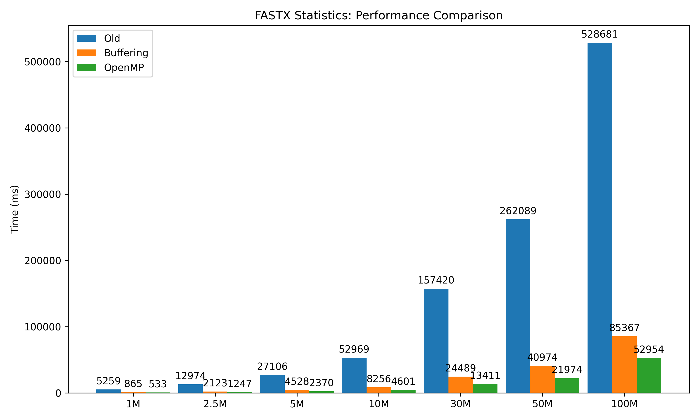

# FASTX-Toolkit
This project is based on [agordon/fastx_toolkit](https://github.com/agordon/fastx_toolkit)  
Goal of project is improve processing performance.  
It provides improved performance through 3 ways:

1. `Buffering`
2. `OpenMP`
3. `CUDA`

All tools use buffering by default.  
`OpenMP` and `CUDA` versions also use buffering by default.

# Features
- [x] FASTQ-TO-FASTA
- [ ] FASTX Statistics
	- [x] [Buffering](fastx-toolkit/fastx-qual-stats)
	- [x] [OpenMP](fastx-toolkit/fastx-qual-stats-omp)
	- [ ] [CUDA](fastx-toolkit/fastx-qual-stats-cuda)
- [x] [FASTX Sample Generator](fastx-toolkit/fastx-samp-gen)

# Usage
`FASTQ-TO-FASTA`
|  Option  | Description | Default | Range | 
|:--------:|:-----------:|:-------:|:-----:|
| -h       | print help  |         |       |
| -i       | set input file name | STDIN ||
| -o       | set output file name | STDOUT ||
| -n       | keep sequence with unknown (N) nucleotides. Default is to discard such sequences. | false ||
| -r       | rename sequence id to number | false ||
| -\-ibufs | set input buffer size | 32768 ||
| -\-mxsl  | set maximum sequence length | 25000 ||

`FASTX Statistics(Buffering)`
|  Option  | Description | Default | Range | 
|:--------:|:-----------:|:-------:|:-----:|
| -h       | print help  |         |       |
| -i       | set input file name | STDIN ||
| -o       | set output file name | STDOUT ||
| -\-bq    | set base quality offset | 33 | 0 - 255 |
| -\-mnq   | set min quality | -15 | BQ + MNQ >= 0 |
| -\-mxq   | set max quality | 93  | BQ + MXQ <= 255 |
| -\-ibufs | set input buffer size | 32768 ||
| -\-mxsl  | set maximum sequence length | 25000 ||

`FASTX Statistics(OpenMP)`
|  Option  | Description | Default | Range | 
|:--------:|:-----------:|:-------:|:-----:|
| -h       | print help  |         |       |
| -i       | set input file name | STDIN ||
| -o       | set output file name | STDOUT ||
| -\-bq    | set base quality offset | 33 | 0 - 255 |
| -\-mnq   | set min quality | -15 | BQ + MNQ >= 0 |
| -\-mxq   | set max quality | 93  | BQ + MXQ <= 255 |
| -\-ibufs | set input buffer size | 32768 ||
| -\-mxsl  | set maximum sequence length | 25000 ||
| -\-rps   | record pool size | 500 ||

# Benchmarks
Device: GA403UI-QS091  
Method: TAKE MINS & ROUND

| Record Size | Old (ms) | Buffering (ms) | OpenMP (ms) | Buffering Speedup (%) | OpenMP Speedup (%) | OpenMP vs Buffering Increase (%) |
|:-----------:|:--------:|:--------------:|:-----------:|:---------------------:|:-------------------:|:--------------------------------:|
| 1M          | 5259     | 865            | 533         | 83.6                  | 89.9                | 38.4                             |
| 2.5M        | 12974    | 2123           | 1247        | 83.7                  | 90.4                | 41.0                             |
| 5M          | 27106    | 4528           | 2370        | 83.3                  | 91.2                | 47.7                             |
| 10M         | 52969    | 8256           | 4601        | 84.4                  | 91.3                | 44.2                             |
| 30M         | 157420   | 24489          | 13411       | 84.4                  | 91.5                | 45.3                             |
| 50M         | 262089   | 40974          | 21974       | 84.4                  | 91.6                | 46.4                             |
| 100M        | 528681   | 85367          | 52954       | 83.8                  | 89.9                | 38.0                             |